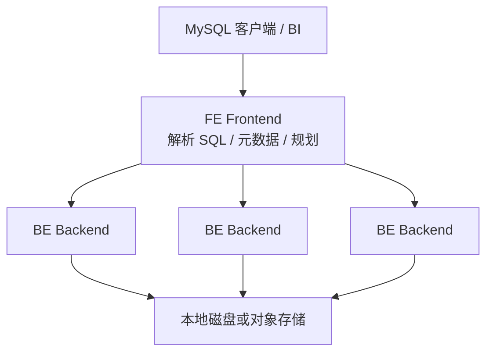

最近在看实时分析引擎，顺手把 [Apache Doris](https://doris.apache.org/zh-CN/docs/3.x/gettingStarted/what-is-apache-doris/) 的定位、架构和电商落地整理了一遍。它和 [Cube 语义层](../cube-semantic-layer-for-ai-analytics/) 不在同一层：Cube 管指标口径和 Agent 查数计划，Doris 更像底下那层 **实时 OLAP 仓库**。

这篇文章先讲 Doris 是什么，再落到电商里怎么用。

## Doris 是什么？

Apache Doris 是基于 **MPP** 架构的高性能实时分析型数据库。目标很明确：在亚秒级返回海量数据的查询结果，同时覆盖高并发点查询和高吞吐复杂分析。

它不是 MySQL / PostgreSQL 这类事务库的替代品，而是面向 OLAP 的分析引擎。典型能力大致是：

| 能力 | 大致水平 |
| --- | --- |
| 查询延迟 | 亚秒级 |
| 写入延迟 | 秒级入库 |
| 并发 | 上万 QPS |
| 规模 | PB 级，单集群可到数百台 |
| 接口 | 兼容 MySQL 协议和标准 SQL |

适合做实时报表、即席查询、统一数仓、数据湖联邦查询加速。常见应用包括大屏看板、用户行为分析、AB 实验、日志检索、用户画像、订单分析。

## 从哪来

前身是百度广告报表系统 **Palo**。2018 年捐给 Apache 孵化，2022 年成为顶级项目。国内互联网和金融、制造等行业用得很多，多数云厂商也提供托管服务。

商业化一侧常见的是飞轮科技的 [SelectDB](https://www.selectdb.com/)。社区版和托管版内核都是 Apache Doris。

## 整体架构

部署时可以选两种模式。



**存算一体**更常见、运维更简单：

- **FE（Frontend）**：接请求、解析 SQL、管元数据
- **BE（Backend）**：存数据、执行计算

FE 有 Master / Follower / Observer。BE 上数据按分片多副本存放。

**存算分离**从 3.0 开始可选：计算和对象存储解耦。BE 可以弹性伸缩，数据放在 S3、HDFS、OSS、COS 等共享存储上，适合算力和存储需求不同步的场景。

## 存储模型和索引

列存 + 压缩，扫无关列更少。表模型主要三种：

| 模型 | 特点 | 适用 |
| --- | --- | --- |
| **明细模型 Duplicate** | 保留每一行 | 事实表明细、行为日志 |
| **主键模型 Unique** | 按 Key UPSERT，可部分列更新 | 订单状态、用户标签、CDC 同步 |
| **聚合模型 Aggregate** | 相同 Key 的 Value 预聚合 | 指标汇总、人群圈选预计算 |

索引方面常用：

- 排序键 / 前缀索引：高并发报表裁剪
- Min/Max、BloomFilter：等值和范围过滤
- 倒排索引：日志、商品描述、评价检索

查询侧是 MPP + 向量化执行 + Pipeline 引擎，配合 Runtime Filter 加速 Join，优化器是 CBO / RBO / HBO 组合。兼容 MySQL 协议，可直接接 Tableau、Power BI、Superset、FineBI 等。

## 电商为什么会用它

电商分析经常同时出现这几组约束：

- **状态一直在变**：下单、支付、发货、退款、库存扣减，不能只靠 T+1
- **查询形态混杂**：既有按 `order_id` / `user_id` 的点查，也有 GMV、转化漏斗、多表 Join
- **大促峰值**：618 / 双 11 写入和查询同时抬升
- **系统太多**：ClickHouse、Druid、Kylin、HBase、MySQL、Trino 叠在一起，口径不一致

Doris 对上这组问题的能力，主要是 Unique Key 更新、MySQL 兼容、MPP Join、高并发点查，以及相对简单的 FE/BE 架构。

数据进入方式几乎都是同一条链路：

```text
MySQL / PostgreSQL（交易）
        │ CDC / Flink
        ▼
      Kafka
        │ Stream Load / Routine Load
        ▼
      Apache Doris
```

离线侧再用 Spark / Hive / Broker Load 回补历史。

## 电商里的典型用法

| 场景 | 数据形态 | 常用模型 | 作用 |
| --- | --- | --- | --- |
| 订单全链路 | 创建 → 支付 → 拣货 → 发货 → 退款 | Unique Key + Sequence 列 | 乱序 CDC 也能落到最新状态 |
| 库存 / 补货 | SKU × 仓 × 门店高频变更 | Unique Key / 部分列更新 | 秒级可见，避免超卖或过量采购 |
| 经营看板 | GMV、转化、客单价、退款率 | Aggregate / 物化视图 | 大屏和 BI 亚秒到秒级 |
| 商家实时报表 | 按店铺、商品、时间下钻 | Duplicate / Unique | 高 QPS、多维组合 |
| 用户画像 / 人群圈选 | 标签交并差、DAU / 留存 | Bitmap + Aggregate | 营销投放、会员运营 |
| 履约 / 物流 | 包裹进度、轨迹 | Unique Key 宽表 | 仓内监控、出库达成 |

订单状态表几乎都会用 Unique Key，并用 Sequence 列处理乱序 CDC：

```sql
CREATE TABLE order_status (
  order_id BIGINT,
  user_id BIGINT,
  shop_id BIGINT,
  status STRING,
  pay_amount DECIMAL(18, 2),
  update_time DATETIME
)
UNIQUE KEY(order_id)
DISTRIBUTED BY HASH(order_id)
PROPERTIES (
  "enable_unique_key_merge_on_write" = "true",
  "function_column.sequence_col" = "update_time"
);
```

用户宽表常用 **部分列更新**：行为流只改浏览 / 加购，交易流只改订单数和金额，不必每天重刷整张宽表。官方说明见 [数据更新概述](https://doris.apache.org/zh-CN/docs/2.1/data-operate/update/update-overview/)。

## 公开落地案例

下面这些数字来自公开技术分享，集群规模和查询模式不同，只能当量级参考。

### 慧策（旺店通）：电商 SaaS 经营分析

面向店铺经营、运营、财务，上游是电商平台、直播和 ERP。原先 ClickHouse 扛不住大表 Join 和高并发；换成 Doris 后，ETL 放进仓库内部做，高峰可达数千 QPS，并按租户规模分区、用 Resource Group 隔离大小客户。

来源：[慧策电商 SaaS 改造实践](https://www.selectdb.com/blog/53)

### 有赞：商家报表 + CDP / DMP / CRM

原来是 Kylin + ClickHouse + Druid。计划用 Doris 统一后：

- Unique Key 覆盖约 90% 业务更新
- 核心 SQL 整体比 ClickHouse 快 2–3 倍
- 40 亿用户行为表 Join，大维表场景最高约 5–10 倍；ClickHouse 会 OOM

来源：[有赞从 ClickHouse 到 Doris](https://www.selectdb.com/blog/107)

### 网易严选：DMP 标签

数据来自自营 App / 小程序，以及京东、淘宝、抖音店铺。Doris 承接标签点查、人群圈选、路径分析：点查和少量表 Join 的 QPS 过万，P99 < 50ms，用来收掉 HBase + Kudu + ES 的双写。

来源：[网易严选 DMP 标签系统](https://doris.apache.org/blog/Netease/)

### 途虎养车：线上预约 + 线下履约

订单、库存、履约、画像链路接近新零售。用 Doris 替换 Hive + HBase + MySQL + Trino 后，人群圈选从超过 60 秒降到 3 秒以内，单用户点查约 10ms，BI P90 从 52 秒降到 7 秒。

来源：[途虎养车统一 OLAP 底座](https://selectdb.com/blog/1716)

### 菜鸟：电商物流履约

服务阿里电商生态的仓储、跨境、末端。公开数据是 25+ 集群、上万核、3 个地域。订单、库存、补货、物流轨迹走 Unique Key / Merge-on-Write；仓内包裹进度场景成本降约 90%，平均 RT 降约 72%。

来源：[菜鸟大规模湖仓实践](https://www.selectdb.com/blog/1451)

### 美团：外卖经营分析

OLAP 查询由 Doris 统一承载，公开规模到 300+ 集群、10 万核、数十 PB。外卖经营分析靠 Colocate Join，商户报表做高并发点查，Bitmap 支撑 DAU / 留存。

来源：[美团数十 PB 规模实践](https://selectdb.com/blog/1723)

## 和同类系统怎么放

| 对比 | 怎么选 |
| --- | --- |
| **PostgreSQL / MySQL** | 继续做下单支付；分析扫描和聚合交给 Doris |
| **ClickHouse** | 单表极快；Doris 更强调 MySQL 兼容、主键更新、多表 Join 和运维一体 |
| **Hive / Spark** | 离线批处理和重刷历史更适合后者；Doris 做实时、交互式查询 |
| **Cube / 语义层** | 不互斥。仓库用 Doris，指标口径和 Agent Plan 仍建议放语义层 |

一个常见分层是：

```text
低于 10 TB：PostgreSQL 往往就够
10 TB 到 1 PB：PostgreSQL（OLTP）+ Doris（OLAP）
超过 1 PB：再加 Spark / 数据湖做离线重处理
```

参考：[80TB 电商分析从 PostgreSQL 迁出](https://www.selectdb.com/blog/1734)

如果上面已经有 Cube，比较顺的链路是：

```text
用户提问 → Agent Plan → Cube 语义层 → Apache Doris → 结果解释
```

Doris 负责新鲜度和查询性能，Cube 负责指标治理和权限投影。授权还可以再接 [OpenFGA](../openfga-authorization-for-ai-analytics/)。

## 落地时反复出现的经验

1. **交易库别替换**。PostgreSQL / MySQL 继续做下单支付，Doris 只吃 CDC。
2. **先收场景再收引擎**。画像点查 + 圈选，或商家实时报表，通常是第一刀。
3. **分区按业务裁**。SaaS 常按租户 + 日期；大客户按月，小客户按年。
4. **大促要隔离**。Resource Group / Tag 把订单、库存、报表拆开，避免一张慢 SQL 拖垮履约。
5. **写入别用 JDBC Insert**。统一 Stream Load，并控制高频小批次，否则 Publish 堆积。
6. **从 ClickHouse 迁过来的原因高度一致**：Join 弱、并发差、更新靠 `FINAL`、扩容停写。

## 总结

Doris 是一款 **实时分析型数据库**，核心价值在于：

1. **秒级入库、亚秒查询** — 适合订单、库存、看板这类一直在变的数据
2. **点查和分析可以放在同一套引擎** — 商家后台、人群圈选、复杂 Join 不用再拆三套系统
3. **MySQL 协议降低迁移成本** — BI 和业务后端都能直接连

它解决不了指标口径和 Agent 乱写 SQL 的问题，那是语义层和授权层的事。但如果你已经在用 Cube 做 AI 查数，底下缺一个能扛实时更新和高并发的 OLAP，Doris 是值得认真看的选项。

---

::::tabs
:::tab{title="参考资源"}
- [Apache Doris 简介](https://doris.apache.org/zh-CN/docs/3.x/gettingStarted/what-is-apache-doris/)
- [数据更新概述](https://doris.apache.org/zh-CN/docs/2.1/data-operate/update/update-overview/)
- [慧策电商 SaaS](https://www.selectdb.com/blog/53)
- [有赞 OLAP 迁移](https://www.selectdb.com/blog/107)
- [网易严选 DMP](https://doris.apache.org/blog/Netease/)
- [途虎养车](https://selectdb.com/blog/1716)
- [菜鸟湖仓](https://www.selectdb.com/blog/1451)
- [美团统一 OLAP](https://selectdb.com/blog/1723)
:::

:::tab{title="相关技术"}
- MPP / 向量化执行
- Unique Key Merge-on-Write
- Flink CDC
- 湖仓一体（Iceberg / Paimon / Hudi）
- Cube 语义层
- OpenFGA 授权
:::
::::

---

*本文基于 2026 年 8 月的公开文档和案例整理，Doris 版本特性和托管产品仍在快速演进，具体请以官方文档为准。*
