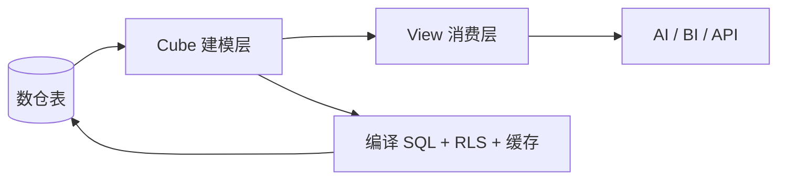

这是一份 **2026-08-18** 的学习笔记，按「先建心智、再补细节」的顺序整理。更偏方案对比与落地架构的内容，见 [Cube 语义层实战：AI 查数场景、技术要点与方案对比](../cube-semantic-layer-for-ai-analytics/)。

## 核心结论

在 AI 查数场景里，Cube 的最佳角色不是「又一个 SQL 数据源」，而是 **语义层 + 查询编译器**：

> **让 LLM 选已认证的指标和维度，让 Cube 生成受治理的 SQL；不要让 LLM 直接写原始表 SQL。**

整条链路可以概括为：



---

## 1. Cube：主题容器，不是场景

**Cube 对应一个业务主题 / 实体**（如订单、用户、商品），不是「订单分析场景」。

| | Cube | 场景（更像 View） |
| --- | --- | --- |
| 指什么 | 「订单」这个对象 | 「销售复盘」「退款分析」 |
| 数量关系 | 一个实体通常一个 Cube | 同一 Cube 可服务多个场景 |

```yaml
cubes:
  - name: orders
    sql_table: public.orders
    description: 订单事实表，一行一笔订单
```

### Cube 是否只对应一张表？

**不是硬性规定。** 常见两种写法：

- `sql_table: public.orders` — 最常见，一张主题表
- `sql: SELECT ... JOIN ...` — 可以涉及多表，但要注意 **粒度**

多表更推荐：**每个主题一个 Cube + Join**，而不是把星型模型全塞进一个 SQL。

---

## 2. Measure：算什么

Measure 定义 **聚合口径**，回答「算多少」。

```yaml
measures:
  - name: total_revenue
    sql: amount
    type: sum
    description: 已完成订单成交额，不含 pending 和退款
    filters:
      - sql: "{CUBE}.status = 'completed'"

  - name: orders_count
    sql: id
    type: count
    description: 订单总数，含 pending
```

| 参数 | 作用 |
| --- | --- |
| `name` | 唯一标识，如 `total_revenue` |
| `sql` | 对哪一列聚合 |
| `type` | `count` / `sum` / `avg` / `count_distinct` 等 |
| `filters` | 把业务口径写死在指标里 |

**Cube 与 Measure 的关系：**

```
Cube: orders（订单主题）
├── total_revenue   ← 算成交额
├── orders_count    ← 算单量
└── avg_order_value ← 算客单价
```

---

## 3. Dimension：按什么切、筛什么

Dimension 是 **属性字段**，用于分组和筛选，回答「按什么看」。

```yaml
dimensions:
  - name: status
    sql: status
    type: string
  - name: created_at
    sql: created_at
    type: time
  - name: city
    sql: city
    type: string
```

| 用户问题 | Measure | Dimension |
| --- | --- | --- |
| 8 月成交额多少 | `total_revenue` | `created_at`（筛 8 月） |
| 按城市看成交额 | `total_revenue` | `city` |
| pending 有多少单 | `orders_count` | `status = pending` |

Measure 的 `filters` 管 **指标口径**；Dimension 管 **这次怎么切**。两者不要混用职责。

---

## 4. 事实表与维表

这是数仓概念，也是 Join 方向的依据。

| | 事实表 | 维表 |
| --- | --- | --- |
| 一行代表 | 一次业务事件（一笔订单） | 一个对象（一个用户） |
| 典型字段 | 金额、数量、外键 | 城市、等级、名称 |
| 在 Cube 里 | 主要放 Measure | 主要放 Dimension |

```
维表 customers              事实表 orders
一行一个用户                一行一笔订单
id, city, region            amount, customer_id, created_at
                              │
                              └── customer_id ──► id
```

Join 通常写在 **事实表 Cube** 上，用 `many_to_one` 指向维表。

---

## 5. Join：两个 Cube 怎么连

```yaml
cubes:
  - name: orders
    joins:
      - name: customers
        relationship: many_to_one
        sql: "{CUBE}.customer_id = {customers.id}"
```

Join 本身不算数，只是 **允许跨 Cube 取字段**：

- Measure 仍留在数字发生的一侧（如 `orders.total_revenue`）
- 另一个 Cube 主要贡献 Dimension（如 `customers.city`）

---

## 6. View：给业务和 AI 看的菜单

View 不定义 SQL 逻辑，只决定 **暴露哪些成员、走哪条 join_path**。

```yaml
views:
  - name: sales_overview
    description: 销售总览。看成交额，可按大区、城市、时间分析。
    meta:
      ai_context: >
        用户说销售额、成交额、GMV，都用 total_revenue。
        用户说华东/华北，用 customer_region，不要用 city equals '华东'。
    cubes:
      - join_path: orders
        includes: [total_revenue, orders_count, created_at]
      - join_path: orders.customers
        includes:
          - name: city
            alias: customer_city
          - name: region
            alias: customer_region
```

使用方看到的是扁平字段：

- `total_revenue`
- `customer_city`
- `customer_region`
- `created_at`

**不是数据库里多了一张宽表**，而是 Cube 编译出的成员目录。查询时再按 `join_path` 还原 Join。

---

## 7. 查询 JSON：名字 vs 值

`/load` 请求里写的是 **要哪些字段**，不是字段等于什么。

```json
{
  "measures": ["sales_overview.total_revenue"],
  "dimensions": ["sales_overview.customer_city"],
  "timeDimensions": [{
    "dimension": "sales_overview.created_at",
    "dateRange": ["2025-08-01", "2025-08-31"]
  }],
  "filters": [{
    "member": "sales_overview.customer_region",
    "operator": "equals",
    "values": ["华东"]
  }]
}
```

| 种类 | 谁给的 | 例子 |
| --- | --- | --- |
| 字段名 | 模型 / View | `customer_region` |
| 筛选值 | 使用方传入 | `"华东"`、`["2025-08-01","2025-08-31"]` |
| 结果值 | 数仓算出来 | 上海 200、杭州 150 |

### 怎么知道有哪些可选值？

`/meta` **不会**列出 `region` 的所有取值。要知道库里实际有哪些值，需要再发一次 `/load` 枚举：

```json
{
  "dimensions": ["sales_overview.customer_region"],
  "measures": ["sales_overview.orders_count"],
  "limit": 50
}
```

> [!WARNING]
> 枚举时带什么 Measure 会改变结果。带 `total_revenue`（自带 completed 过滤）得到的是「有过成交的大区」；带中性 `orders_count` 更接近「出现过订单的大区」。查字典值应优先查维表 Cube，或在模型 `description` 里写清取值。

### 用户说「华东」，库里存的是「上海/杭州」怎么办？

- **枚举**只能告诉你库里字符串长什么样
- **「华东包含哪些城市」** 要靠 `region` 字段，或 `meta.ai_context` 写映射

不要让 LLM 用世界知识猜地理口径。

---

## 8. 完整业务例子

**用户：**「2025 年 8 月华东成交额多少？按城市拆开。」

**Agent 流程：**

1. `searchDataModel` 或检索 `/meta` → 找到 `sales_overview.total_revenue`、`customer_region`、`customer_city`
2. 组装 `/load` JSON（`region=华东`，`dateRange=8月`，`dimensions=customer_city`）
3. Cube 编译 SQL，注入 measure 口径（`status=completed`）
4. 返回并按口径解释

**结果：**

| 城市 | 成交额 |
| --- | --- |
| 上海 | 200 |
| 杭州 | 150 |
| **合计** | **350** |

北京 300 因 `region=华北` 被 filter 排除；上海 pending 80 因 measure 口径被排除。

---

## 9. Segment：预置分析范围

Segment 是 **命名好的过滤片段**，查询时启用：

```yaml
segments:
  - name: completed_orders
    sql: "{CUBE}.status = 'completed'"
    description: 仅已完成订单
```

```json
{
  "measures": ["sales_overview.orders_count", "sales_overview.total_revenue"],
  "segments": ["sales_overview.completed_orders"]
}
```

| | Measure filters | Segment |
| --- | --- | --- |
| 影响范围 | 只影响该指标 | 影响本次查询所有 measure |
| 典型用途 | 指标口径（成交额只算 completed） | 分析范围（这次只看已完成订单） |

---

## 10. 没有 MCP，直走 API

Agent 可以自己调 Cube REST API：

| 步骤 | API |
| --- | --- |
| 发现字段 | `GET /cubejs-api/v1/meta` |
| 查数 | `POST /cubejs-api/v1/load` |
| SQL 风格 | SQL API（Postgres 方言） |

没有官方 MCP 时，需要自己实现 **meta 检索**（向量库 / 关键词），不能整份 meta 塞进 prompt。

本地 **Cube Core** 可用社区 MCP（如 `@mob999/cube_mcp`）包装同一套 API；**Cube Cloud Premium+** 才有官方 MCP（`searchDataModel`、`chat`、`runQuery`）。

---

## 11. Security Context 与 RLS

**Security context** 是 JWT 里「这次查询代表谁」的已验证身份；**filters** 是「这次分析想看什么」。两者不能混。

```json
{
  "user_id": 101,
  "role": "regional_manager",
  "region": "华东"
}
```

Cube 在 `query_rewrite` 里强制注入：

```javascript
queryRewrite: (query, { securityContext }) => {
  if (securityContext.role === 'regional_manager') {
    query.filters.push({
      member: 'sales_overview.customer_region',
      operator: 'equals',
      values: [securityContext.region]
    })
  }
  return query
}
```

AI 发的业务查询可以完全不写大区；权限由 Token 决定，**不能靠 prompt 假装身份**。

### RLS vs Meta 成员过滤

| | RLS / Access Policy | `/v1/meta` |
| --- | --- | --- |
| 过滤对象 | **行数据**（编译 SQL 时注入 WHERE） | **成员可见性**（哪些 View/Measure/Dimension 出现在目录里） |
| 是否枚举成员值 | 否 | 否（值要靠 `/load` 查） |

---

## 12. Cube Cloud 与 MCP 选型速查

| 部署 | 官方 MCP | 语义检索 |
| --- | --- | --- |
| Cube Core 本地自建 | ❌ | 社区 MCP 或自研 meta 检索 |
| Cube Cloud Free | ❌ | 有 Analytics Chat，无官方 MCP |
| Cube Cloud Premium+ | ✅ | `searchDataModel` 语义搜索 |

Cube Cloud 有 Free 档，但 **Agent + 官方 MCP** 通常需要 Premium（约 $80/Developer/月）及额外计算资源。

---

## 设计分工速查表

| 放哪里 | 放什么 |
| --- | --- |
| **Cube** | 数据来源、Join、Measure 计算、Segment 定义 |
| **View** | 暴露哪些字段、业务命名、`join_path`、`ai_context` |
| **Measure** | 指标口径（算什么） |
| **Dimension** | 分组 / 筛选属性（按什么看） |
| **Segment** | 可复用的分析范围 |
| **Security Context** | 谁有权看什么（JWT + query_rewrite） |
| **filters（查询里）** | 这次分析临时限定（如只要上海） |

---

## 总结

1. **Cube** 是主题容器，不是报表场景
2. **Measure / Dimension** 分别回答「算什么」和「按什么看」
3. **Join** 锁死关联路径，**View** 锁死消费菜单
4. 查询 JSON 里是 **字段名**；**筛选值** 和 **结果值** 来源不同
5. **枚举维度值** 靠 `/load`，且要注意 Measure 自带口径
6. **权限** 在 JWT + 编译期 RLS，不能交给 LLM 的 filters

---

:::tabs
:::tab{title="相关文章"}
- [Cube 语义层实战：AI 查数场景、技术要点与方案对比](../cube-semantic-layer-for-ai-analytics/)
- [OpenFGA 学习指南：AI 查数场景中的细粒度权限](../openfga-authorization-for-ai-analytics/)
:::

:::tab{title="参考链接"}
- [Cube 官方文档](https://cube.dev/docs)
- [MCP Server 文档](https://docs.cube.dev/docs/integrations/mcp-server)
- [Security Context](https://docs.cube.dev/docs/data-modeling/access-control/context)
- [AI Context 建模](https://docs.cube.dev/docs/data-modeling/ai-context)
- [Views 设计指南](https://docs.cube.dev/docs/data-modeling/views)
:::
::::

---

*本文基于 2026-08-18 与 AI 的对话式学习整理，侧重建模心智与查数流程；方案对比与 E-Graph、预聚合等进阶主题见姊妹篇。*
