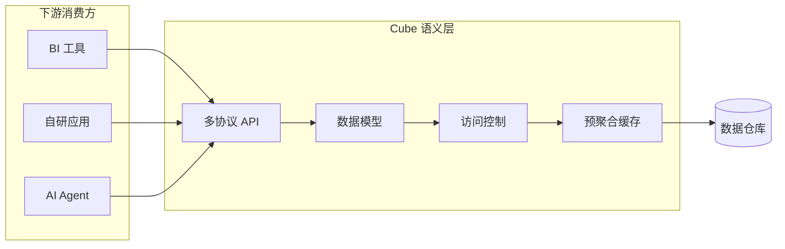
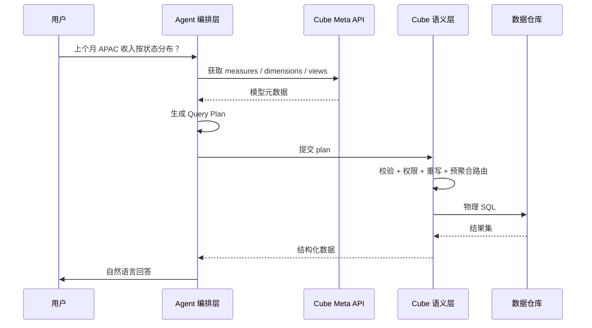
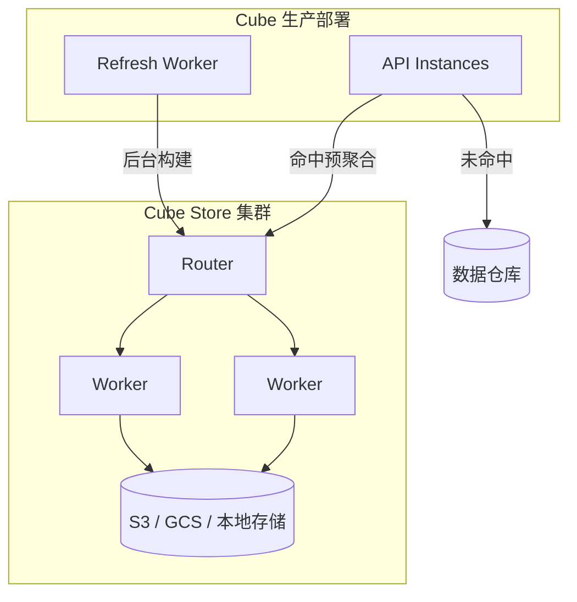

最近在做 **AI 查数** 相关的探索：让 Agent 根据用户自然语言制定查数计划（Plan），再由语义层负责校验、权限控制和物理 SQL 转换。调研下来，[Cube](https://cube.dev/)（开源项目 [cube-js/cube](https://github.com/cube-js/cube)）是目前在这个方向上最成熟的开源方案之一。

这篇文章把调研结论整理成一份可落地的教程，涵盖 Cube 的定位、核心架构、AI 查数场景设计、技术要点，以及和其他方案的对比。

## Cube 是什么？

Cube 不是前端框架，也不是通用 Web 框架。它是一个面向 **BI、嵌入式分析、AI Agent** 的 **语义层（Semantic Layer）** 平台。

它要解决的核心问题很具体：

- 指标定义分散在 SQL、BI 工具、应用代码里，口径不一致
- AI Agent 直接写 SQL 查仓库，容易 join 错、聚合层级错、绕过权限
- 高并发查数时，每次都打仓库，成本和延迟都不可控

Cube 的做法是：**在数据仓库和应用/Agent 之间加一层语义中间件**，把 measures、dimensions、joins、访问规则、缓存策略集中定义，再统一暴露给下游。



## 产品形态：Cube Core vs Cube Cloud

Cube 有两层产品，数据模型可以双向移植：

| 产品 | 性质 | 适合场景 |
| --- | --- | --- |
| **Cube Core** | 开源（Apache 2.0），可自托管 | 自建 Agent 查数、嵌入式分析、需要完全掌控基础设施 |
| **Cube / Cube Cloud** | 商业托管平台 | 要开箱即用的 Dashboard、Analytics Chat、MCP、RBAC、多租户 |

> [!NOTE]
> Cube Core 是 headless 的，不自带 UI。如果你要做自己的 AI 查数产品，通常用 Cube Core 或 Cube Cloud 的 API 层，UI 和 Agent 编排自己实现。

**许可说明：**

- Cube Backend：Apache 2.0
- Cube Client：MIT
- Cube Cloud：按开发者席位 + 基础设施计费，有免费开发 tier

## 核心使用场景

### 1. AI Agent 查数（本文重点）

典型链路：

1. 用户用自然语言提问
2. Agent 理解意图，查询模型元数据（有哪些指标、维度）
3. Agent 输出 **查数 Plan**（结构化 JSON 或 Semantic SQL）
4. Cube 语义层校验 Plan、注入权限、重写查询、生成物理 SQL
5. 执行查询，返回结果给 Agent 做解释和可视化



**关键原则：Agent 不直连仓库、不写物理 SQL。** 它只产出语义层能理解的 plan，由语义层完成治理和转换。

### 2. 嵌入式分析

SaaS 产品内嵌报表、客户侧数据看板。Cube 提供 REST / GraphQL / SQL API，前端或 BFF 直接消费，配合预聚合实现亚秒级响应。

### 3. 统一指标治理

多个 BI 工具（Tableau、Power BI、Metabase）和自研应用共用一套指标定义，避免「同一个 GMV 在不同报表里数字不一样」。

### 4. 高并发 API 查数

通过 pre-aggregations + Cube Store（Rust OLAP 缓存引擎），把热点查询从仓库切到本地缓存，降低成本和延迟。

## 核心架构

典型生产部署包含三个组件：

| 组件 | 职责 |
| --- | --- |
| **API Instances** | 处理 REST / GraphQL / SQL 请求，决定走缓存还是查仓库 |
| **Refresh Worker** | 后台构建和刷新 pre-aggregations，维护 refresh keys |
| **Cube Store** | 分布式 OLAP 引擎，以 Parquet 存储预聚合，支持 Router + Worker 水平扩展 |



## 数据建模

Cube 的模型是 **Code-first**，用 YAML 或 JavaScript 定义，纳入 Git 管理，支持 CI/CD 和 Code Review。

两类核心对象：

| 对象 | 作用 |
| --- | --- |
| **Cube** | 业务实体（订单、用户等），定义 measures、dimensions、joins |
| **View** | 面向消费方的 curated 数据集，人类和 Agent 主要查 View |

### Metric 与 Dimension：先分清两个基本概念

读 Cube 模型和 Agent Plan 时，最容易混的是 **metric（指标 / measure）** 和 **dimension（维度）**。可以简单记：

| | **Metric（指标 / Measure）** | **Dimension（维度）** |
| --- | --- | --- |
| 回答的问题 | **算什么、算多少** | **按什么切开、按什么筛选** |
| 常见类型 | 计数、求和、平均、比率 | 类别、状态、地区、时间 |
| SQL 直觉 | `COUNT` / `SUM` / `AVG` … | `GROUP BY` / `WHERE` 里的字段 |
| Cube 字段 | `measures` | `dimensions`（时间常单独放在 `timeDimensions`） |
| 问句线索 | 「多少、总共、平均、占比」 | 「按地区、按状态、上个月、APAC」 |

**Metric** 是对一批数据做聚合后得到的数，例如：

- `orders.count` → 订单数
- `orders.total_revenue` → 收入合计
- `orders.avg_order_value` → 客单价

**Dimension** 用来描述、分组、过滤，一般不直接「加总成一个业务 KPI」，而是规定从哪个角度看指标，例如：

- `orders.status` → 已支付 / 已取消
- `orders.region` → APAC / EU
- `orders.channel` → App / Web
- `orders.created_at` → 时间（常称为 time dimension）

两者合在一起才是一条完整查数 Plan：

```text
查什么数？     → metrics:    total_revenue
怎么切开看？   → dimensions: region, status
限定哪一段？   → filters / time: APAC, 上个月, 按天
```

> [!NOTE]
> 权限目录里两者都要管：无权 metric 不能算；敏感 dimension（如客户邮箱、销售负责人）不该出现在分组或过滤里。OpenFGA 侧的对象级授权，见 [OpenFGA 学习指南](../openfga-authorization-for-ai-analytics/)。

示例模型：

```yaml
cubes:
  - name: orders
    sql_table: public.orders

    measures:
      - name: count
        type: count
      - name: total_amount
        sql: amount
        type: sum

    dimensions:
      - name: status
        sql: status
        type: string
      - name: created_at
        sql: created_at
        type: time

    pre_aggregations:
      - name: orders_by_day
        measures: [count, total_amount]
        dimensions: [status]
        time_dimension: created_at
        granularity: day
        refresh_key:
          every: "1 hour"
```

> [!TIP]
> 给 AI Agent 暴露数据时，优先通过 **View** 而不是底层 Cube。View 是 curated 的数据集，能减少 Agent 选错表、选错 join 路径的概率。

## AI 查数：Agent Plan 的两种形态

Cube 支持两种 Agent 输出格式，对应不同的灵活性和治理强度。

### 方案 A：结构化 Query Plan（推荐作为默认）

Agent 输出 JSON，而不是 SQL：

```json
{
  "measures": ["orders.total_amount", "orders.count"],
  "dimensions": ["orders.status"],
  "timeDimensions": [{
    "dimension": "orders.created_at",
    "dateRange": ["2026-01-01", "2026-08-12"],
    "granularity": "month"
  }],
  "filters": [{
    "member": "orders.region",
    "operator": "equals",
    "values": ["APAC"]
  }],
  "limit": 100
}
```

通过 REST API 提交：`POST /cubejs-api/v1/load`

**优势：**

- Plan 空间有限，LLM 不容易乱写 SQL
- 字段限定在已治理的 measures / dimensions 内，天然防幻觉
- 适合多轮对话：先查 meta → 组 plan → 执行 → 根据错误重试

**劣势：**

- 复杂 ad-hoc 计算（窗口函数、嵌套子查询）表达能力弱

### 方案 B：Semantic SQL（适合分析师级探索）

Agent 输出带语义扩展的 SQL：

```sql
SELECT
  orders.status,
  MEASURE(orders.total_amount),
  MEASURE(orders.count)
FROM orders_view
WHERE orders.created_at >= '2026-01-01'
GROUP BY 1
```

通过 Cube SQL API 提交（Postgres 兼容协议，默认端口 15432）。

**优势：**

- LLM 本来就会 SQL，上手快
- 可在已治理指标上做 ad-hoc 派生计算
- Cube 用 E-Graph 重写引擎转成目标仓库方言的物理 SQL

**劣势：**

- 比结构化 plan 更容易写出语义层不接受的 SQL
- 需要更强的 prompt 约束和错误重试机制

### 怎么选？

| 场景 | 建议 |
| --- | --- |
| 面向业务用户的对话查数 | 结构化 JSON plan 为主 |
| 分析师级 ad-hoc 探索 | Semantic SQL 为辅 |
| 混合模式 | 先尝试 JSON；复杂计算再降级 Semantic SQL |

## 技术要点

### 1. Semantic SQL 与 E-Graph 查询重写

Cube 的 SQL API（CubeSQL）基于 Apache DataFusion，核心是 **E-Graph 重写引擎**（Rust `egg` 库）：

1. 接收 Semantic SQL，解析为逻辑计划
2. 转换为 E-Graph，并行应用多条重写规则
3. 识别语义层成员（measures / dimensions），展开 `MEASURE()` 函数
4. 用代价模型选出最优计划
5. 生成目标仓库方言的物理 SQL（Snowflake、BigQuery、Redshift 等）

为什么需要 E-Graph？因为语义层的 measures 需要感知外层查询的聚合层级，而标准 SQL 是自底向上求值的。Cube 作为独立语义层，不能依赖目标仓库的查询优化器，必须自己完成 rewrite 和方言转换。

### 2. Pre-aggregations 预聚合缓存

在模型里声明 rollup 表，Refresh Worker 定期从仓库拉数写入 Cube Store。查询时由 aggregate awareness 引擎自动路由：

```yaml
pre_aggregations:
  - name: orders_by_day
    measures: [count, total_amount]
    dimensions: [status]
    time_dimension: created_at
    granularity: day
    refresh_key:
      every: "1 hour"
```

官方称可比直连仓库快 **10–100 倍**，并显著降低仓库查询成本。代价是需要为高频查询维度设计预聚合，并运维 Cube Store 集群。

### 3. 访问控制

策略在语义层统一执行（Python / JavaScript），对 SQL、REST、GraphQL、Agent 一视同仁：

- 行级 / 列级权限
- 多租户（不同租户可走不同数据源）
- JWT 认证，编译期注入过滤条件

> [!WARNING]
> 多租户场景下，租户 ID 应通过 JWT 传递，访问策略在 Cube 侧编译。**不要把权限逻辑写在 Agent 的 prompt 里**，那不可靠也不可审计。

### 4. 多协议 API

| API | 用途 |
| --- | --- |
| **SQL API** | Postgres 兼容，扩展 `MEASURE()` 等 Semantic SQL |
| **REST (JSON)** | `/v1/load`、`/v1/meta` 等，适合 Web 应用和 Agent |
| **GraphQL** | 前端 / 嵌入式场景 |
| **MDX / DAX** | 对接 Power BI、Excel 等微软生态 |
| **MCP Server** | 给 Claude、ChatGPT 等 Agent 提供受治理的指标访问 |
| **Meta API** | 模型自省，Agent 发现可查询的 measures / dimensions |

### 5. MCP 与 Agent 集成

Cube 提供 MCP（Model Context Protocol）Server，让 Agent 通过标准协议发现模型、执行查数。典型 Agent 工具链：

| 步骤 | Agent 动作 | Cube 能力 |
| --- | --- | --- |
| 1. 理解意图 | 解析时间、指标、维度、过滤条件 | — |
| 2. 发现模型 | 查有哪些可用品类 | `GET /v1/meta` 或 MCP |
| 3. 生成 Plan | 输出 JSON plan 或 Semantic SQL | Agent 自研 |
| 4. 执行与纠错 | 提交查询，失败则根据错误重试 | `/v1/load` 或 SQL API |

MCP Server 在 Cube Cloud Premium+ 计划可用。如果自研 Agent，直接用 REST / SQL API 更灵活。

## 数据源支持

Cube 支持 **20+ SQL 数据源**，包括：

- 云数仓：Snowflake、BigQuery、Databricks、Redshift
- 查询引擎：Presto、Athena、Trino
- 应用库：PostgreSQL、MySQL、ClickHouse 等

## 快速上手（PoC）

本地用 Docker 启动 Cube Core：

```bash
docker run -p 4000:4000 -p 15432:15432 \
  -v ${PWD}/model:/cube/conf \
  -e CUBEJS_DEV_MODE=true \
  cubejs/cube
```

验证流程：

```bash
# 1. 拉取模型元数据
curl http://localhost:4000/cubejs-api/v1/meta

# 2. 提交结构化 plan
curl -G http://localhost:4000/cubejs-api/v1/load \
  --data-urlencode 'query={"measures":["orders.count"],"dimensions":["orders.status"]}'

# 3. 调试物理 SQL（可选）
curl -G http://localhost:4000/cubejs-api/v1/sql \
  --data-urlencode 'query={"measures":["orders.count"]}'
```

Agent 开发时，建议把 **meta → plan → load → 解释结果** 拆成 4 个独立 tool，比一步到位 Text-to-SQL 稳定得多。

## 方案对比

### Cube vs 裸 Text-to-SQL

| 维度 | 裸 Text-to-SQL | Agent Plan + Cube 语义层 |
| --- | --- | --- |
| 指标口径 | 每次重新推导 `SUM(...)` | 用已认证的 `orders.total_revenue` |
| Join 关系 | 容易 join 错表 / 错粒度 | 模型里预定义 joins |
| 权限 | 靠 prompt 或应用层补丁 | 编译期强制 |
| 多轮对话 | 上下文容易漂移 | Plan 可序列化、可审计 |
| 性能 | 每次全表扫 | 预聚合自动路由 |
| 上手速度 | 快 | 需要先建语义模型 |

### Cube vs dbt Semantic Layer

| 维度 | dbt Semantic Layer | Cube |
| --- | --- | --- |
| 定位 | 指标定义贴近 dbt transform 代码 | Headless API 优先的语义层 |
| 适合团队 | 已深度使用 dbt，主要服务 BI | 嵌入式分析、API 产品、AI Agent |
| 缓存 | 有限（Enterprise） | 内置 pre-aggregations + Cube Store |
| API | GraphQL、JDBC | SQL、REST、GraphQL、MDX、DAX、MCP |
| 开源 | MetricFlow 开源，SL 需 dbt Cloud | Cube Core 完整开源 |
| 学习曲线 | 中等 | 中等偏高（模型 + 预聚合 + 运维） |

**选型建议：** 如果团队已是 dbt 中心、主要消费方是 Tableau / Power BI，dbt SL 更自然。如果要给客户嵌分析、做 AI 查数 API，Cube 更合适。

### Cube vs Looker / LookML

| 维度 | LookML | Cube |
| --- | --- | --- |
| 定位 | BI 原生建模语言 | 独立语义层 + 多协议 API |
| 生态绑定 | 强绑定 Looker / Google Cloud | 仓库和下游工具中立 |
| 治理成熟度 | 非常成熟（10+ 年） | 成熟且在 AI Agent 方向快速演进 |
| 嵌入式分析 | 有限 | 核心场景 |
| 成本 | Looker 许可较高 | Cube Core 免费自托管 |

**选型建议：** 如果已买 Looker 全家桶，LookML 往往更省事。如果需要 API 驱动的多产品指标服务，Cube 更灵活。

### 综合对比表

| 方案 | 更适合的场景 | 主要优势 | 主要劣势 |
| --- | --- | --- | --- |
| **Cube** | AI 查数、嵌入式分析、高并发 API | 多协议 API、强缓存、Agent 治理 | 自托管运维成本不低 |
| **dbt SL** | dbt 中心、BI 一致性 | 与 transform 代码一体 | Agent API 弱、缓存有限 |
| **LookML** | Looker 为主 BI | 治理成熟、BI 体验好 | 生态绑定 |
| **Snowflake / Databricks 原生语义层** | 单仓库内统一指标 | 部署简单 | 厂商锁定 |
| **自研语义层** | 极度定制化 | 完全可控 | SQL 重写、多方言、缓存成本高 |

## AI 查数落地建议

如果采用「Agent 制定 Plan + 语义层转物理 SQL」架构，以下是实践中的关键设计点：

### 1. 模型设计

- 给 Agent 暴露 **View**，不直接暴露所有底层 Cube
- 指标命名用业务语言（`total_revenue` 而不是 `sum_amount`）
- 在 View 层预定义常用 segments（如「已完成订单」「活跃客户」）

### 2. Agent 编排

建议拆成 ReAct / Tool-calling 四步：

1. **理解意图** — 提取时间范围、指标、维度、过滤条件
2. **发现模型** — 调用 Meta API，确认 member 存在
3. **生成 Plan** — 输出 JSON 或 Semantic SQL
4. **执行与纠错** — 提交查询，根据错误信息修正 plan

### 3. 可观测性

每次查数记录：

- 用户原始问题
- Agent 生成的 plan
- Cube 生成的物理 SQL
- 执行耗时和是否命中预聚合

方便审计、调优 prompt 和优化预聚合策略。

### 4. 多租户

JWT 携带 `tenant_id`，访问策略在 Cube 编译期注入。Agent 不需要知道租户过滤逻辑。

### 5. 预聚合策略

按高频对话问题维度建 rollup：

- 时间粒度：按天 / 按月
- 地理维度：按地区 / 国家
- 业务维度：按状态 / 渠道 / 产品线

## 部署选型

| 方式 | 特点 | 适合阶段 |
| --- | --- | --- |
| **Docker 本地 / 自托管** | 完全自控，Apache 2.0 免费 | PoC、对基础设施有要求的团队 |
| **Cube Cloud** | 托管集群、蓝绿发布、MCP、Analytics Chat | 快速上线、不想自建运维 |

自托管需要关注的组件：API Instances、Refresh Worker、Cube Store 集群、S3/GCS 存储。生产环境建议 Cube Store 以集群模式运行，而不是单实例。

## 优势与局限

### 优势

- 开源核心 + 商业平台可选，模型双向移植
- 多协议 API，嵌入式和 Agent 场景成熟
- Pre-aggregations + Cube Store 对高并发友好
- Semantic SQL + E-Graph 重写，AI 查数治理方向清晰
- 模型即代码，适合 CI/CD

### 局限

- 学习曲线：模型、预聚合、Cube Store 集群都有运维成本
- 自托管 TCO 不低（机器、Refresh Worker、对象存储等）
- 不是 BI 全家桶，UI 需自研或购买 Cube Cloud
- 与 dbt 的集成不如 dbt SL 原生

## 总结

Cube 是一个面向数据分析的 **语义层框架**，核心价值在于：

1. **指标定义一次，处处使用** — BI、自研应用、AI Agent 共用同一套治理模型
2. **Agent 查数的正确架构** — Agent 制定 plan，语义层转物理 SQL，而不是让 LLM 直接写仓库 SQL
3. **性能与成本可控** — 预聚合 + Cube Store 让对话式查数不至于拖垮仓库

如果你的业务场景是 **AI 查数**，推荐架构是：

```
用户提问 → Agent 编排（意图理解 + Plan 生成）→ Cube 语义层（校验 + 权限 + SQL 重写 + 缓存）→ 数据仓库 → 结果解释
```

结构化 JSON plan 作为默认输出，Semantic SQL 作为复杂分析的补充。语义模型通过 View 暴露给 Agent，权限在编译期强制，不依赖 prompt。

---

:::tabs
:::tab{title="参考资源"}
- [Cube 官方文档](https://docs.cube.dev/)
- [Cube Core GitHub](https://github.com/cube-js/cube)
- [Semantic SQL 技术博客](https://cube.dev/blog/how-semantic-sql-works)
- [AI Agent 语义层指南](https://cube.dev/articles/semantic-layer-for-ai-agents-2026)
- [REST API Query Format](https://docs.cube.dev/reference/core-data-apis/rest-api/query-format)
:::

:::tab{title="相关技术"}
- Model Context Protocol (MCP)
- Apache DataFusion
- E-Graph 查询优化
- Pre-aggregation / OLAP 缓存
- Text-to-SQL vs Semantic Layer
:::
::::

---

*本文基于 2026 年 8 月的调研整理，Cube 的 AI Agent 能力（MCP、Semantic SQL、D3）仍在快速演进，具体特性请以官方文档为准。*
