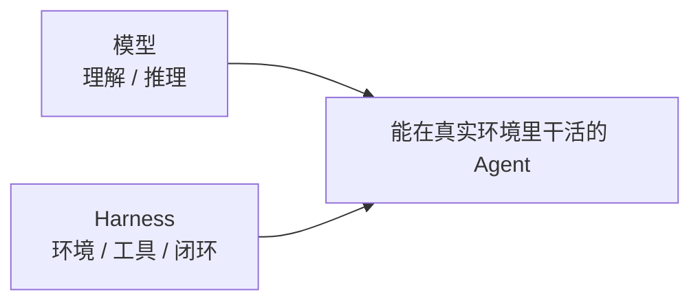
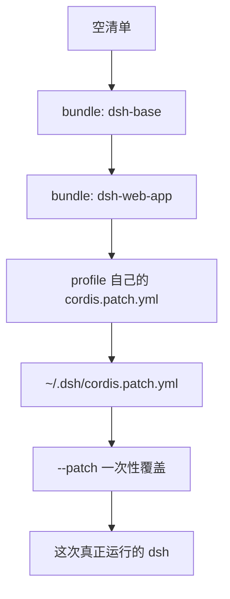

DeepSeek 把 2026 年的竞争焦点说得很直白：**Agent = Model + Harness**。模型负责理解和推理；Harness 负责把能力落到真实环境——读文件、跑命令、调工具、管上下文、处理错误、把任务跑完。

[DeepSeek Harness](https://deepseek.com/harness/en/)（CLI 名 `dsh`）就是这条公式里「Harness」一侧的开源实现。它现在是 **MIT 许可的 Developer Preview**，面向的主要是 **Agent Harness 开发者**，不是再做一个只能点一点的消费级 IDE。

这篇文章把公开资料整理成一份可读完的报告：产品定位、团队时间线、Cordis 架构，以及最容易卡住的三件事——**profile、bundle、`cordis.patch.yml`**。

> [!NOTE]
> 仓库仍在快速迭代，官方写明会有破坏性变更。下文以 2026 年 8 月中的公开文档和源码为准。网上不少「DeepSeek Code 下载」「9 个子 Agent 吊打 Claude Code」页面是 SEO 站，不要当官方材料。

## 它是什么

`dsh` 不是新模型。它是套在模型外面的 **Agent 运行时**：

- 官网：[deepseek.com/harness](https://deepseek.com/harness/en/)
- 源码：[github.com/deepseek-ai/deepseek-harness](https://github.com/deepseek-ai/deepseek-harness)
- 文档：[deepseek-harness.github.io](https://deepseek-harness.github.io/deepseek-harness/en/guide/quickstart)
- 口号：**Everything is a plugin**

可替换的能力包括：模型、工具、skills、session、sandbox、存储、agent loop、调度、UI。换能力靠配置和插件，不改 `dsh` 源码。

最快试跑：

```sh
npx @deepseek-ai/dsh web
```

默认 Web UI 在 `http://127.0.0.1:3080`。配 DeepSeek API key，选一个 workspace 就能跑。也支持其他 OpenAI-compatible 接口。另外还有 Python SDK、headless / CLI。



和我之前写的 [第一个智能体笔记](../my-first-agent/) 对照：那里的 LLM、Prompt、Tools、Memory，在 `dsh` 里全部被拆成可插拔插件，并且多了一层很重的工程：**谁来组合这些插件、一次运行如何可回放**。

## 时间线

| 时间 | 事件 |
| --- | --- |
| 2026-03 | 崔添翼加入 DeepSeek |
| 2026-05 | Harness 内部立项，独立专项团队 |
| 2026-05-20 | 公开招 Harness 研发 / 产品；[V2EX](https://www.v2ex.com/t/1214141) 由崔添翼本人发帖 |
| 2026-06 | 负责人称缺口很大，每天面试 |
| 2026-08-01 | 面向开源 Agent 开发者招募内测（要 GitHub + 代表作） |
| 约 8 月初 | Developer Preview 开源；内测反馈开始出现 |
| 2026-08 中 | 公开预览仍在快速迭代 |

招聘原文写得很清楚：除模型本体以外的所有工作都属于 Harness，目标是做 **桌面端 Agent 产品**，内部对标 Claude Code。公开仓库在预览期就已经有很高的关注度，提交历史也很长，说明内部做了一段时间，不是空壳发布。

## 架构：Cordis + 一切皆插件

底层不是 LangChain / AutoGen 那类编排库，而是 [Cordis](https://github.com/cordiverse/cordis)。设计论文是 [*A Programming Paradigm for Spatiotemporal Composability*](https://github.com/cordiverse/paper)。思路接近 OSGi / 热插拔：插件挂上、卸下、声明依赖，副作用可以回滚。

五个核心概念：

1. **Plugin = Service**：函数或 `Service` 子类，挂进 context
2. **Context 是服务仓库**：`ctx.tools`、`ctx.llm`、`ctx.sessions`，按 key 找，不直接 import 实现
3. **`inject` 声明依赖**：加载顺序由服务依赖决定，不是手写 boot 序列
4. **Typed events**：`emit` / `waterfall` / `parallel` / `serial`
5. **注册都是可逆 effect**：卸载时 prompt、tool schema、adapter、listener 一起拆掉

核心包大致是：

| 包 | 职责 | ctx |
| --- | --- | --- |
| `core/session` | 只追加的 session 日志 | `ctx.sessions` |
| `core/system-prompt` | prompt 分段 + tool schema | `ctx.systemPrompt` |
| `core/tools` | 工具注册与执行管道 | `ctx.tools` |
| `core/agent` | Agent 接口与 `agent/*` 事件 | `ctx.agents` |
| `core/agent-loop` | 默认 driver | `ctx.agentLoop` |
| `llm/llm` | 消息 / 流式适配层 | `ctx.llm` |

有一条硬约束：**模型看见的东西必须能从 session log 重建**。resume / fork / replay / Trajectory 视图都走同一条 append-only 事件流。

## 运行时怎么叠出来

启动 `dsh` 时，并没有一份写死的完整配置文件。它从一张**空白清单**开始，一层一层往上贴补丁。贴完的那张清单，才是这次真正跑起来的 Agent。

三个词经常一起出现，职责不同：

| 概念 | 问的问题 | 它是什么 |
| --- | --- | --- |
| **Profile** | 这次叠哪些层、按什么顺序？ | 本机上的一份启动配方 |
| **Bundle** | 这一包贡献什么？ | 可分发的一层（代码 + 补丁） |
| **`cordis.patch.yml`** | 这一层具体改清单的哪几行？ | YAML 补丁文件 |

官方有一句硬话：**bundle 是你写了拿去分发的东西；profile 是用户用 `dsh --profile 名字` 启动的东西。没有任何东西同时是两者。**

容易说反的一点：

> Profile 是配方，不是底。Bundle 才是被叠上去的那一层。



### Profile：启动配方

Profile 是你电脑上的一个目录，默认在：

```text
~/.dsh/profiles/<名字>/
```

`web` 就是 `~/.dsh/profiles/web/`。里面主要两份文件：

```text
~/.dsh/profiles/web/
├── package.json         # 这份配方用哪些 bundle、按什么顺序
└── cordis.patch.yml     # 只对这个配方生效的个人改动
```

`package.json` 大概长这样：

```json
{
  "dsh": {
    "profile": {
      "bundles": [
        "@deepseek-ai/dsh-base",
        "@deepseek-ai/dsh-web-app"
      ]
    }
  }
}
```

读成人话：启动时先贴底盘，再贴 Web 界面；贴完这两层，才轮到这个配方自己的补丁。

第一次跑 `dsh web` / `dsh headless` 时，这两个配方会自动生成。一般不用手写 profile；装插件用：

```sh
dsh plugin --profile web add ./hello-plugin
```

它会初始化 profile（如果还没有），把包装进去，再把 bundle 名追加到 `bundles` 列表末尾。

### Bundle：可分发的一层

一个 bundle 就是一个 npm 包，里面通常三样东西：

```text
hello-plugin/
├── package.json        # 声明：我是一个 bundle
├── cordis.patch.yml    # 这一层要往清单里插 / 改哪些插件
└── index.js            # 真正的代码
```

`package.json` 里关键的是：

```json
{
  "dsh": {
    "bundle": {
      "patch": "./cordis.patch.yml"
    }
  }
}
```

谁把这个包列进 profile，就把这份 `cordis.patch.yml` 当成一层贴上去。没有 `dsh.bundle` 声明的包也能装，但只是普通依赖，不会激活一层。

官方最重要的两个 bundle：

| Bundle | 干什么 |
| --- | --- |
| `@deepseek-ai/dsh-base` | 底盘。模型适配、工具、权限、sandbox、凭证。每个 profile 都先贴这一层 |
| `@deepseek-ai/dsh-web-app` | 在底盘上面加浏览器界面：Web 服务器、设置页、对话 UI |

还有一个兄弟 `@deepseek-ai/dsh-headless`：同样站在 `dsh-base` 上，但不装 Web，只做一次性无界面运行。

所以 **Web 配方 = 同一套底盘 + 一层「变成浏览器产品」的补丁**。Headless 配方 = **同一套底盘 + 另一层「不要界面、跑完就退出」的补丁**。

### `cordis.patch.yml`：这一层的改动说明书

它不是程序，也不是 Cordis 框架本身，只是一份 YAML：告诉启动器「往清单里加哪些插件、改哪几行、关掉哪几行」。

名字可以拆开读：

- **cordis**：底下那个插件内核
- **patch**：补丁。不是完整配置，是「在当前清单上再改一刀」

所以它永远是一个数组。每一项都是一次手术。

清单里的一行是一个要加载的插件，大致长这样：

```yaml
id: tool-bash                          # 这一行的身份证，后面靠它来改
name: '@deepseek-ai/dsh-tool-bash'     # 去哪加载代码
disabled: false                        # 要不要挂上
config:                                # 传给这个插件的参数
  timeoutMs: 60000
```

补丁对这张表做两种手术。

**插入：清单里还没有，加进去。** `dsh-base` 面对的是空清单，所以几乎全是 `insert`：

```yaml
- insert:
    - id: llm
      name: '@deepseek-ai/dsh-llm'

    - id: session
      name: '@deepseek-ai/dsh-session'

    - id: agent-default-model
      name: '@deepseek-ai/dsh-agent-default-model'
      config:
        provider: deepseek-official
        model: deepseek-v4-flash
```

**覆盖：清单里已经有这个 id，整行配置换成我的。** `dsh-web-app` 贴在 `dsh-base` 后面，所以它按 id 改：

```yaml
- id: system-prompt
  config:
    persona: >-
      You are a coding agent powered by the {{model}} model.
      Your working directory is {{cwd}}.

- id: tool-bash
  disabled: true
```

第一段：底盘已经有 `system-prompt`，把它的人设改成 coding agent。  
第二段：底盘已经挂了 bash 工具，Web 这层先关掉，后面改由每个会话的 preset 再挂。关掉而不是删掉，是为了避免以后有人重排 bundle 时这行又冒出来。

同一份文件里也可以两种混用：先改几行旧的，再 `insert` 一堆 Web 专用的（`webserver`、`ui-conversation`……）。

每一层用的都是同一种补丁格式，只是放的位置不同：

| 放在哪 | 谁写的 | 作用范围 |
| --- | --- | --- |
| bundle 包里的 `cordis.patch.yml` | 插件作者 | 谁把这个包列入 profile，谁就吃这一层 |
| `~/.dsh/profiles/web/cordis.patch.yml` | 你 | 只影响 `web` 这个配方 |
| `~/.dsh/cordis.patch.yml` | 你 | 这台电脑上所有配方 |
| `--patch ./foo.yml` | 你（临时） | 只影响这一次启动 |

教程路径也按这个成熟度来：先 `--patch` 加载本地插件 → 觉得好了再打成 bundle → `dsh plugin add` 装进某个 profile。

### 叠加顺序

对应到 `web`：

```text
空
 ①  dsh-base                               先把模型、工具、sandbox 全部插进来
 ②  dsh-web-app                            改几行底盘配置，再插入 Web 服务器和 UI
 ③  ~/.dsh/profiles/web/cordis.patch.yml    只影响 web 这个配方
 ④  ~/.dsh/cordis.patch.yml                 这台电脑上所有配方都吃
 ⑤  --patch ./我的临时改动.yml              只影响这一次启动
```

**后贴的赢。** ④ 比 ③ 后，所以「整机偏好」压过「这个配方的偏好」。⑤ 最后，所以命令行是一次性覆盖。`--patch` 可以写多个，按参数顺序往后盖。

想看叠完长什么样，不用猜：

```sh
dsh --profile web --dump-config
```

输出里会用 `# == dsh-base`、`# == dsh-web-app` 这种注释标出每一层来自哪。那就是启动时真正会挂上的树。

用点外卖来记：

```text
空盘子
   │
   ▼
bundle: dsh-base          ← 套餐固定的饭和菜（每个配方都有）
   │
   ▼
bundle: dsh-web-app       ← 再加碗汤、换成「网页版」摆盘
   │
   ▼
profile 的 patch          ← 「我这个套餐不要香菜」
   │
   ▼
~/.dsh 的 patch           ← 「这台电脑上所有套餐都少放盐」
   │
   ▼
--patch                   ← 「就这一单，临时加个蛋」
   │
   ▼
端上桌 = 这次真正运行的 dsh
```

### 两个容易踩的坑

> [!WARNING]
> 覆盖不是「改其中一个字段」，是「整份 `config` 换掉」。

假设底盘里某行是：

```yaml
config:
  host: 127.0.0.1
  port: 3080
  printUrl: true
```

你只想改端口，写成：

```yaml
- id: webserver
  config:
    port: 4000
```

结果不是「端口变 4000、其余照旧」，而是 `host` / `printUrl` 全部消失。正确做法是把还想保留的字段一起重写一遍。官方自己的 `dsh-web-app` 覆盖 `dsh-base` 时，也是整份重写。

第二个坑：空的 `cordis.patch.yml` 会直接报错。文件不存在没问题；存在但只有注释、解析出来不是数组，会当成损坏。这一层暂时什么都不改，写成：

```yaml
[]
```

一个最小的有用例子：想在 `web` 配方里把默认模型改成 V4 Pro，不用改官方源码，只要在 `~/.dsh/profiles/web/cordis.patch.yml` 里写：

```yaml
- id: agent-default-model
  config:
    provider: deepseek-official
    model: deepseek-v4-pro
```

底盘已经插入过 `agent-default-model`；你这份补丁后贴，按 id 整份 `config` 换掉。

## 四种运行模式

| 模式 | 做什么 |
| --- | --- |
| **Standard** | 完整 coding agent：文件编辑、shell、搜索、skills、planning、goals、subagents、workflows |
| **Code** | Standard 的能力，但工具通过 Code Mode SDK 暴露；模型用一段 TypeScript 编排多步调用 |
| **Minimal** | 只留 persistent bash + `str_replace_editor`，用来给模型做干净评测 |
| **Creator** | Standard + 运行时自省，内存里试 Cordis 插件，组新 preset |

Creator 模式很说明产品意图：这是 **给 harness 作者用的 harness**，不只是给写业务代码的人用的 IDE agent。Minimal 模式则说明他们认真把 harness 当评测夹具，不只当产品壳。

## 一次对话怎么跑

一条 **step** 是一次模型请求，加上它调用的工具。一条 **turn** 是零个或多个 step：在第一次输入被认领时打开，直到没有欠账才关掉。

```mermaid
sequenceDiagram
    participant User
    participant Loop as agent-loop
    participant Prompt as system-prompt
    participant LLM as llm
    participant Tools as tools

    User->>Loop: 输入进 inbox
    Loop->>Loop: turn/start，claim 下一条
    Loop->>Prompt: 拼 prompt 分段 + tool schema
    Prompt-->>Loop: agent/pre-step（可改写或拒绝）
    Loop->>LLM: agent/request → llm/stream
    LLM-->>Loop: assistant/message
    Loop->>Tools: tool/call → pre-execute → execute → post-execute
    Tools-->>Loop: tool/result
    alt 工具还欠下一次请求
        Loop->>LLM: 下一个 step
    else 没有欠账
        Loop->>Loop: turn/end
    end
```

`agent/pre-step`、`agent/request`、`llm/stream` 和三条 `tools/*` 事件是 waterfall：监听者必须调用 `next()` 才能把控制权交给下一层，也可以短路。这就是权限、沙箱、策略能插进去的地方。

Session log 是模型上下文的来源。`deriveMessages()` 从日志投影出模型历史；原始 `assistant/chunk` 保留回放和 UI 保真。Fork、resume、转写、遥测、持久化都从同一条流派生。

> [!TIP]
> 官方把这条写成运行时不变量：**Model-visible means logged.** 任何进到模型请求里的内容，都必须能从日志重建。所以新加一种「模型能看见的输入」，就要扩展 `SessionEventMap`，并从日志渲染，而不是在 loop 里偷偷塞字符串。

## 怎么跑起来

通过 npm：

```sh
npx @deepseek-ai/dsh web
```

从源码：

```sh
git clone https://github.com/deepseek-ai/deepseek-harness.git
cd deepseek-harness
pnpm install
pnpm run build
pnpm dsh web
```

Web UI 起来之后：

1. **Settings → Models** 填 DeepSeek API key，保存后不用重启
2. **Choose workspace** 选项目目录，不选就没法发消息
3. 开一个 session，例如：「Summarize this repository and identify its main packages.」

危险操作会按当前权限策略弹确认。模型配置指南还覆盖其他 provider 和自定义 OpenAI-compatible 端点。

社区插件话题是 [`dsh-plugin`](https://github.com/topics/dsh-plugin)。GitHub 上另一个混杂的 `deepseek-harness` topic 大量是 SEO 站，不可信。

## 和 Claude Code / OpenCode / Cursor

三层不要混：

1. **模型**：DeepSeek V4 已经能跑在别人的 harness 里（Claude Code、OpenCode、Cursor、Cline 等）。社区里常见结论是：同模型换 harness，质量差往往不大，差在 token、耗时、权限、恢复策略。
2. **第三方 harness**：OpenCode、Pi、Reasonix、Aider 是现在跑 DeepSeek 的常用壳。
3. **第一方 harness**：`dsh` 是第三条线——自己做可组合运行时，并往桌面 Agent 产品走。

| | Claude Code | OpenCode / Pi | DeepSeek Harness |
| --- | --- | --- | --- |
| 定位 | 产品闭环强，绑 Anthropic 模型 | 多模型、轻、可插插件 | 把 loop / 工具 / 权限 / UI 全部插件化 |
| 开源 | 否 | 是 | MIT，官方自己当参考实现 |
| 主要用户 | 写代码的人 | 写代码、换模型的人 | 先给 harness 作者，再长成产品 |
| 当前状态 | 成熟消费级 | 成熟开源壳 | Developer Preview |

可以把它理解成：DeepSeek 承认 2026 年锁客点已经从模型挪到 harness，所以既让 V4 能跑进别人的壳，也自己做一层可组合的底座。

## 团队

负责人 **崔添翼（tianyi）**：浙大计算机，背包九讲作者，Jane Street 约 9 年，后在香港创办 TSY Capital，2026 年 3 月加入 DeepSeek。岗位强调的不是训模型，而是：

- Agent loop / tool use / skills / MCP / memory / subagent
- Prompt / Context / Harness engineering
- 自己必须是高强度 Agent 用户
- 和模型训练团队一起做 **模型与 harness 共同进化**

地点最初限北京，后来放宽到「先北京半年，再可杭州」。8 月内测帖变成一场开源 Agent 路演：有人统计约 700+ 报名项目，前三是智能体框架、编程智能体、记忆与上下文。

## 该怎么看

**值得看的点**

- 官方承认竞争焦点已经从模型挪到 harness
- 插件边界比多数开源 coding agent 更干净：service + 可逆 effect + 事件拦截
- session log 作为单一事实源，适合评测、回放、训练反馈
- Minimal mode 说明他们认真把 harness 当评测夹具
- MIT + 源码开放，社区可以直接 fork / 写 bundle

**要降权的点**

- 仍是 developer preview，API 会破
- 面向 harness 开发者，终端用户体验还不是主叙事
- 桌面产品形态尚未作为稳定消费级产品发布
- 冒充页很多，只认官网和 `deepseek-ai/deepseek-harness`

一句话：**DeepSeek 把「壳」升级成和模型同级的产品线。** `dsh` 是这条线的开源内核；真正的消费级 Code Agent 还在后面。

## 参考

::::tabs
:::tab{title="官方"}
- [产品页](https://deepseek.com/harness/en/)
- [源码](https://github.com/deepseek-ai/deepseek-harness)
- [架构文档](https://github.com/deepseek-ai/deepseek-harness/blob/master/docs/architecture.md)
- [Cordis 入门](https://deepseek-harness.github.io/deepseek-harness/en/reference/cordis-primer)
- [打包与安装插件](https://deepseek-harness.github.io/deepseek-harness/en/develop/basic/publish)
:::
:::tab{title="背景"}
- [V2EX · Agent Harness 研发工程师](https://www.v2ex.com/t/1214141)
- [Cordis](https://github.com/cordiverse/cordis)
- [社区插件话题 dsh-plugin](https://github.com/topics/dsh-plugin)
:::
::::
