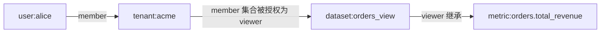
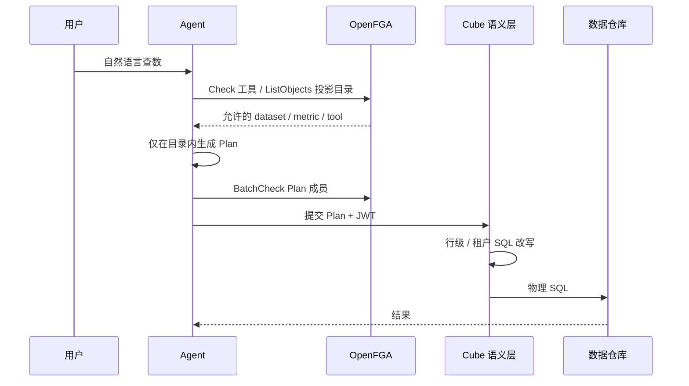
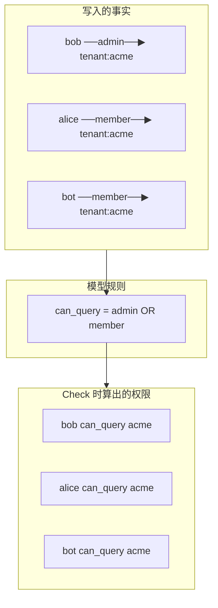

在 [Cube 语义层实战](../cube-semantic-layer-for-ai-analytics/) 里，查数链路是：**Agent 制定 Plan → 语义层转物理 SQL**。这条链路还缺一块：**谁能查什么**。

Cube 能在 SQL 里注入租户、行级过滤，但管不好这些事：

- Agent「代用户查数」不等于拥有用户的全部权限
- 有人能看 GMV，不能看毛利
- Meta / Prompt 里不该出现无权指标的字段名
- 能否调用 `cube_load`、能否导出、能否看物理 SQL

[OpenFGA](https://openfga.dev/) 补的就是这一层：**对象级、关系型、可投影的授权**。这篇文章把它整理成一份学习指南，覆盖概念、Schema 读法、AI 查数用法，以及和其他方案的对比。

## OpenFGA 是什么？

OpenFGA 是受 Google **Zanzibar** 启发的开源细粒度授权引擎（CNCF，Apache 2.0），由 Auth0 / Okta 贡献。

它做的不是登录认证（Authentication），而是 **授权（Authorization）**：

> 主体 `U` 对对象 `O` 是否具有关系 `R`？

核心范式是 **ReBAC（Relationship-Based Access Control）**：权限由「主体—关系—对象」组成的关系图决定，而不是一张简单的角色表。

| 概念 | 含义 | 示例 |
| --- | --- | --- |
| **Type** | 对象类型 | `user`、`tenant`、`dataset`、`metric`、`agent` |
| **Relation** | 关系 / 权限 | `viewer`、`member`、`can_query` |
| **Tuple** | 一条授权事实 | `user:alice` 是 `dataset:orders` 的 `viewer` |
| **Authorization Model** | 类型与关系的 DSL | 定义谁能继承谁的权限 |

Tuple 的读写格式是：

```text
对象#关系@主体
tenant:acme#member@user:alice
```

读作：Alice 是租户 acme 的 member。



Check「Alice 能不能查 `orders.total_revenue`」时，OpenFGA 沿着这张图走，而不是在业务代码里写一串 if-else。

## 为什么 AI 查数特别需要它？

传统报表权限往往是「这个角色能进这个页面」。AI 查数更像协作系统：

| 风险 | 说明 |
| --- | --- |
| Agent ≠ 用户 | 「帮我查」不是「拥有我的全部权限」 |
| 指标级权限 | 能看收入，不能看毛利 |
| 上下文泄漏 | 无权字段名被塞进 Prompt / Meta |
| 工具权限 | 能否调用查数、导出、看 SQL |
| 多租户 | 只能看本租户数据 |

OpenFGA 官方已有 [AI Agent Authorization](https://openfga.dev/docs/use-cases/ai-agent-authorization) 指南，覆盖：

- Agents as principals：Agent 作为一等主体
- Task-based authorization：按任务临时授权
- RAG authorization：检索后再按权限过滤
- MCP server authorization：工具级权限

这和「Agent + 语义层」是对齐的：模型只能看见它有权看见的目录，再在目录里做 Plan。

## 在 AI 查数架构中的位置



分层建议：

| 层 | 职责 | 工具 |
| --- | --- | --- |
| 身份认证 | 你是谁 | OIDC / JWT |
| 应用 / Agent 授权 | 能用哪些工具、看哪些指标 / 数据集、代谁操作 | **OpenFGA** |
| 查询执行授权 | 行级、租户过滤落到 SQL | **Cube securityContext** |
| 仓库侧 | 兜底（可选） | Warehouse RLS |

OpenFGA 负责 **「能不能碰这个对象」**；Cube 负责 **「查的时候 SQL 里带上正确的行过滤」**。两者互补，不要互相替代。

## 核心 API

| API | 问题 | AI 查数用途 |
| --- | --- | --- |
| **Check** | 有没有这个关系？ | 执行前：能否查询该 metric |
| **BatchCheck** | 批量 Check | 一次校验 Plan 里多个 measures |
| **ListObjects** | 能访问哪些某类型对象？ | 投影 Agent 可见目录 |
| **ListUsers** | 谁能访问某对象？ | 审计、共享管理 |
| **Expand** | 展开权限推导树 | 调试「为什么有权限」 |
| **Write** | 写入 / 删除 tuple | 授权变更、任务级临时授权 |

Check 示例：

```json
{
  "tuple_key": {
    "user": "user:alice",
    "relation": "can_query",
    "object": "metric:orders.total_revenue"
  }
}
```

ListObjects 示例（给 Agent 做可见指标目录）：

```json
{
  "user": "user:alice",
  "relation": "can_query",
  "type": "metric"
}
```

返回类似：`["metric:orders.count", "metric:orders.total_revenue"]`。Agent 只能基于这些生成 Plan。

## 一份面向 AI 查数的 Schema

下面这份模型是学习用的最小草案，对应 Cube 的 View / measure / 工具。

```text
model
  schema 1.1

type user

type agent
  relations
    define owner: [user]
    define can_act_on_behalf_of: [user]

type tenant
  relations
    define admin: [user]
    define member: [user, agent]
    define can_query: admin or member

type dataset
  relations
    define tenant: [tenant]
    define viewer: [user, agent, tenant#member]
    define can_query: viewer

type metric
  relations
    define parent: [dataset]
    define viewer: [user, agent] or viewer from parent
    define can_query: viewer

type tool
  relations
    define can_call: [user, agent, task]

type task
  relations
    define assignee: [agent]
    define creator: [user]
```

> [!NOTE]
> 原稿里 `tool.can_call` 引用了 `task`，但没有定义 `type task`。正式导入 OpenFGA 前必须补上，否则模型校验会失败。上面已经补了最小的 `task` 类型。

### `model` / `schema 1.1`

声明这是 OpenFGA 授权模型，语法版本 1.1。版本本身不包含业务含义。

### `type user`

**人**。通常只作为关系左边的主体，所以没有 `relations`。Tuple 里写成 `user:alice`。

### `type agent`

**AI Agent**，和人一样是一等主体。

| 关系 | 含义 | `[...]` |
| --- | --- | --- |
| `owner` | 谁拥有这个 Agent | 只能是 `user` |
| `can_act_on_behalf_of` | Agent 可以代谁行动 | 只能是 `user` |

```text
agent:query-bot#owner@user:alice
agent:query-bot#can_act_on_behalf_of@user:alice
```

Alice 拥有 `query-bot`，并允许它代自己查数。撤销委托时删掉第二条即可，不必动 Alice 本人权限。

> Agent **不等于**用户。没有委托关系，它只是一个独立主体。

### `type tenant`

**租户 / 组织**。

| 关系 | 含义 |
| --- | --- |
| `admin` | 管理员，只能是人 |
| `member` | 成员，可以是人或 Agent |
| `can_query` | 计算关系：admin **或** member 就能查 |

### `type dataset`

对应 Cube 的 **View / Cube**（一张可查询的业务数据集）。

| 关系 | 含义 |
| --- | --- |
| `tenant` | 属于哪个租户 |
| `viewer` | 谁能看 |
| `can_query` | 能看就能查 |

`viewer` 的赋值类型是：

```text
[user, agent, tenant#member]
```

第三种是 ReBAC 的精髓：可以把权限授给「某租户的全部成员」，而不用给每个人写一条 dataset 权限。

### `type metric`

对应 Cube 的 **measure**。

```text
viewer: [user, agent] or viewer from parent
```

读作：可以直接授权给人 / Agent，**或者**继承 parent dataset 的 viewer。这样「能看订单数据集」默认就能看该数据集下的指标，敏感指标再单独收紧。

### `type tool` / `type task`

控制 Agent 能调用哪些能力（`cube_load`、`cube_meta`、`export_csv`）。`task` 用来做会话级临时授权：会话开始写 tuple，结束删 tuple。

## 直接关系 vs 计算关系

这是读 Schema 时最容易混的一点。

```text
define admin: [user]
define member: [user, agent]
define can_query: admin or member
```

| 关系 | 类型 | 要不要写 tuple | 作用 |
| --- | --- | --- | --- |
| `admin` | 直接关系 | 要 | 存「谁是管理员」 |
| `member` | 直接关系 | 要 | 存「谁是成员」 |
| `can_query` | 计算关系 | 不要 | Check 时用上面两条推 |

你存的是事实：

```text
tenant:acme#admin@user:bob
tenant:acme#member@user:alice
tenant:acme#member@agent:query-bot
```

**没有任何一条**是 `tenant:acme#can_query@...`。

当你发起：

```text
Check(user:alice, can_query, tenant:acme)
```

OpenFGA 会展开规则：

```text
alice 有 can_query？
  ⇔ alice 是 admin？ 或 alice 是 member？
       ↓                    ↓
     查 tuple             查 tuple
     没有                  有 alice#member
  ⇒ allowed = true
```



为什么要拆开：如果只写 `can_query`，就分不清「因为是管理员」还是「因为是成员」。拆开后：

- **存事实**：`admin` / `member`
- **问业务**：统一 Check `can_query`

以后若改成「只有 admin 能查」，只需改模型：

```text
define can_query: admin
```

已有 member 的 tuple 不用动，Alice 立刻失去 `can_query`，Bob 仍有。

记忆口诀：

- 模型里带 `[user]` / `[user, agent]` 的 → **直接关系** → **写 tuple**
- 模型里用 `or` / `and` / `from` 拼出来的 → **计算关系** → **只 Check，不写**

## `can_query` 不是固定名称

`can_query` 只是这份草案里自己起的名字，**不是 OpenFGA 的保留字**。

关系名由你在 `define xxx:` 里定义。Check / ListObjects 的 `relation` 参数必须等于模型里真实存在的名字。

社区习惯（不是强制）：

| 风格 | 例子 | 通常表示 |
| --- | --- | --- |
| 角色 / 身份 | `admin`、`member`、`owner`、`viewer` | 直接写 tuple |
| 权限 / 动作 | `can_query`、`can_view`、`can_call` | 用 `or` / `from` 算出的 Check 入口 |

`can_*` 只是可读性约定。换成 `can_read_data` 或直接 Check `viewer` 都可以，只要模型和调用方一致。

引擎真正限制的是命名规则（小写、数字、下划线等），不是这个词本身。

## 使用示例：一次完整查数

假设已有这些 tuple：

```text
tenant:acme#member@user:alice
tenant:acme#member@agent:query-bot
agent:query-bot#can_act_on_behalf_of@user:alice

dataset:orders_view#tenant@tenant:acme
dataset:orders_view#viewer@tenant:acme#member

metric:orders.count#parent@dataset:orders_view
metric:orders.total_revenue#parent@dataset:orders_view

tool:cube_load#can_call@agent:query-bot
```

用户问：「上个月 APAC 收入？」

推导链：

```text
Alice ∈ tenant:acme#member
  → Alice 是 dataset:orders_view#viewer
    → Alice 是 metric:orders.total_revenue#viewer
      → Alice 有 can_query
```

应用侧流程：

```python
user = f"user:{user_id}"

# 1. 工具权限
assert fga.check(user="agent:query-bot", relation="can_call", object="tool:cube_load")

# 2. 目录投影
allowed_metrics = fga.list_objects(user=user, relation="can_query", type="metric")
allowed_datasets = fga.list_objects(user=user, relation="can_query", type="dataset")

# 3. Agent 只吃投影后的 catalog
plan = agent.plan(question, catalog={
    "metrics": allowed_metrics,
    "datasets": allowed_datasets,
})

# 4. 防幻觉：Plan 再校验一遍
for measure in plan["measures"]:
    assert measure in allowed_metrics

# 5. 行级不走 OpenFGA
cube.load(plan, security_context={"tenant_id": tenant_id})
```

对应的 Cube Plan 仍然可以很细：

```json
{
  "measures": ["orders.total_revenue"],
  "dimensions": ["orders.region", "orders.channel", "orders.status"],
  "timeDimensions": [{
    "dimension": "orders.created_at",
    "dateRange": ["2026-07-01", "2026-07-31"],
    "granularity": "day"
  }],
  "filters": [
    { "member": "orders.region", "operator": "equals", "values": ["APAC"] }
  ]
}
```

## 要不要先做权限投影？

要，但**不是**先把用户能看的每一行都从 OpenFGA 拉出来。

投影的是 **目录 / 能力**，行级过滤仍交给 Cube。

| 投影对象 | 要不要先问 OpenFGA | 原因 |
| --- | --- | --- |
| 能用哪些工具 | 要 | Agent 不该看见无权工具 |
| 能看哪些 dataset / metric | 要 | 否则 LLM 会按无权指标组 Plan |
| 能看哪些租户 | 要 | 多租户边界 |
| 能看哪些 `order_id` | **不要**全量投影 | 基数太大；用 Cube / RLS |

```text
1. Check 工具权限
2. ListObjects 投影目录
3. Agent 只在目录内生成 Plan
4. BatchCheck 再校验 Plan 成员
5. Cube 执行时做行级 / 租户过滤
```

如果只在最后 Check 一次：

- Agent 已经把无权指标写进思考过程
- Meta 可能把「毛利」「薪酬」暴露给模型
- 失败后再重试，浪费 token，还可能泄漏 schema

先投影的效果：模型的可见世界一开始就是授权过的。这和 RAG 里「检索后按权限过滤文档，再送给 LLM」是同一类问题。

三种做法按数据量选：

| 做法 | 何时用 | AI 查数里对应 |
| --- | --- | --- |
| 先 ListObjects，再查询 | 对象少（指标、数据集、工具） | **目录投影：必做** |
| 先查候选，再 BatchCheck | 候选已经缩小 | Plan 里少量 measure 的二次校验 |
| 执行时改写 SQL | 行级百万 / 亿级 | Cube 租户过滤：**必做** |

`ListObjects` 适合大约千级的小集合。指标、View、工具正好是这个量级；订单行不是。

落地时还有一步常被忽略：权限投影要和 **Cube Meta** 取交集。

```text
Agent 的 catalog
  = OpenFGA 投影出的允许对象
  ∩ Cube Meta 里真实存在的成员
```

- 只信 OpenFGA：可能授权了已删、不存在的 metric
- 只信 Cube Meta：会把无权指标塞进 Prompt / Plan

所以：**存在性看 Cube，权限看 OpenFGA，Agent 只看交集。** 两边还要做命名对齐（如 `metric:orders.total_revenue` ↔ `orders.total_revenue`）。

## Metric 与 Dimension 分别是什么？

谈「目录里有哪些积木」之前，先分清两个词。它们来自语义层（Cube 里对应 `measures` / `dimensions`），也是 OpenFGA 里最常投影的两类对象：

| | **Metric（指标 / Measure）** | **Dimension（维度）** |
| --- | --- | --- |
| 回答的问题 | **算什么、算多少** | **按什么切开、按什么筛选** |
| 例子 | `orders.count`、`orders.total_revenue` | `orders.region`、`orders.status`、`orders.created_at` |
| 问句线索 | 「多少、总共、平均、占比」 | 「按地区、按状态、上个月、APAC」 |
| 在 Plan 里 | `measures` | `dimensions` / `filters` / `timeDimensions` |

一句话：

- **Metric** = 要算的数（多少钱、多少单）
- **Dimension** = 从哪个角度切、筛这个数（哪里、什么状态、哪天）

权限上两者都要管：无权 metric 不能进 catalog；敏感 dimension（如 `customer_email`）也不该暴露给 Agent。更完整的语义层说明见 [Cube 语义层实战](../cube-semantic-layer-for-ai-analytics/)。

## 目录限制会不会让 Plan 不够细？

不会。**目录限制的是「能用哪些积木」，不是「Plan 能拼多细」。**

| | 权限目录 | Plan 粒度 |
| --- | --- | --- |
| 管什么 | 哪些 metric / dataset / 工具可用 | 怎么切、怎么滤、聚合到哪一层 |
| 变细靠什么 | 把更多成员放进目录 | dimensions、filters、time granularity |
| 不会变细的原因 | 少了一个无权指标 | 目录里根本没有维度 |

目录里有 `orders.total_revenue` 以及 `region` / `channel` / `status` / `created_at`，就足以写出「APAC × 渠道 × 状态 × 每天」的明细聚合。OpenFGA 并没有把查询收成「只能查全公司一个总数」。

真正变粗的情况是 catalog 设计太粗：只投影了 `dataset:orders`，却不把 dimension 交给 Agent。那是建模问题，不是「先做权限投影」这个机制本身。

推荐：**成员级目录，而不是一个大 dataset 包打天下。**

```text
✅ 投影这些（通常几十到几百）
   dataset / metric / dimension

❌ 不要投影这些
   order:1001, order:1002, ...
```

细度来自 Cube 模型，不是来自「列出所有行」。Agent 不需要先拿到 800 万个 `order_id` 才能把 Plan 做细。

如果某些维度也敏感（`customer_email`、`sales_owner`），就把 dimension 也做成 OpenFGA 对象，只从目录里拿掉这些字段。Plan 会少一种切法，其余切法仍然细。这是「可见字段变少」，不是引擎把查询变粗。

就算改用 Semantic SQL，限制仍是「只能引用目录内成员」，不是禁止 `DATE_TRUNC`、派生计算：

```sql
SELECT
  DATE_TRUNC('day', orders.created_at),
  MEASURE(orders.total_revenue) / NULLIF(MEASURE(orders.count), 0) AS aov
FROM orders_view
WHERE orders.region = 'APAC'
GROUP BY 1
```

## 方案对比

| 方案 | 模型 | 状态 | 适合 | 相对 OpenFGA |
| --- | --- | --- | --- | --- |
| **OpenFGA** | ReBAC（Zanzibar） | 存关系图 | 多租户、共享、Agent 委托、ListObjects | — |
| **SpiceDB** | ReBAC | 存关系图 | 强一致、大规模生产 | 更贴近 Zanzibar；商业支持强；运维更重 |
| **OPA / Cedar** | ABAC / 策略引擎 | 无状态 | 属性 / 上下文决策、K8s 策略 | 关系图要自己塞进请求，不适合「列出我能看的指标」 |
| **Casbin** | RBAC / ABAC 库 | 嵌入式 | 简单应用内鉴权 | 无原生图遍历 / ListObjects |
| **Cube securityContext** | 查询重写 | 应用内 | 行级、租户 SQL 过滤 | 不做跨资源关系图与 Agent 委托 |
| **仓库 RLS** | SQL 策略 | 库内 | 最终兜底 | 无法管 Agent 工具、指标目录、MCP |

针对 AI 查数：

- 需要「用户能看哪些指标 / 数据集 / 工具」+ Agent 委托 → **OpenFGA（或 SpiceDB）**
- 需要「SQL 里强制 `tenant_id = ?`」→ **Cube securityContext**（必做）
- 两者一起用，各管一层

OpenFGA 自己也区分两类引擎：

- **关系引擎**（OpenFGA、SpiceDB）：关系存在库里，适合「谁和谁有关」以及反向查询
- **策略引擎**（OPA、Cedar）：无状态，请求时把属性带进去，适合「这个请求的属性满不满足规则」

AI 查数的目录投影是典型的反向查询（「这个用户能看哪些 metric」），关系引擎更合适。

## 优势与局限

### 优势

- 专为细粒度、关系型权限设计，和 Agent / 共享 / 组织层级契合
- `ListObjects` 直接支撑「Agent 可见目录」
- 官方有 AI Agent / RAG / MCP 建模指南
- CNCF、多语言 SDK、可自托管（Postgres / MySQL）
- 权限变更写 tuple 即可，不必改代码发版
- 计算关系让「存身份」和「问能不能做」分开，改规则不必重写全部授权数据

### 局限

- **不是**行级百万对象过滤器；大集合要分层或外部索引
- 需要维护 tuple 与业务数据同步（用户入组、租户变更）
- 多一次网络调用，要做好缓存 / BatchCheck
- 模型设计有学习曲线；错误建模会导致性能差或权限过宽
- Cube 不会原生调用 OpenFGA，集成要在 Agent / BFF 层自己做
- `ListObjects` 有超时和结果上限，不适合当全量行扫描

## 落地建议

### 权限对象粒度

| 粒度 | 例子 | 建议 |
| --- | --- | --- |
| 粗 | tenant、workspace | 必做 |
| 中 | dataset View、报表 | 必做（Agent meta 过滤） |
| 细 | 单个 measure / dimension | 敏感字段建议做 |
| 极细 | 单行 `order_id` | **不要**全塞 OpenFGA，交给 Cube / RLS |

### PoC

1. Docker 起 OpenFGA + Postgres
2. 导入上面的最小模型
3. 写入租户成员、dataset viewer、metric parent
4. Agent 查数前：`ListObjects(metric)` → 约束 Plan → `BatchCheck` → 调 Cube

### 生产

1. JWT 携带 `user` / `tenant` / `agent` / `task`
2. 任务级临时授权：会话开始写 tuple，结束删 tuple
3. Cube `queryRewrite` 强制行级 / 租户过滤（即使 OpenFGA 漏了也不穿库）
4. 审计：记录 Check 决策、Plan、物理 SQL
5. 生产模型里建议把「Agent 代查」做成 **用户权限 ∩ Agent 权限**，不要只 Check 其中一侧

### 和 Cube 叠用的一句话

```text
认证(JWT)
  → OpenFGA（能查哪些对象 / Agent 能否代办 / 工具能否调用）
    → Agent 生成 Plan（只在授权目录内）
      → Cube（语义校验 + 行级 SQL 改写 + 预聚合）
        → 仓库
```

## 总结

OpenFGA 是面向关系图的授权引擎，不是策略脚本引擎，也不是行级过滤器。

在 AI 查数里记住四件事：

1. **Schema 定义规则，tuple 存储事实。** `can_query` 这类名字是自定义计算关系，不是保留字，通常不写 tuple。
2. **先投影目录，再让 Agent 做 Plan。** 投影的是工具、dataset、metric，不是每一行数据。
3. **目录变小不等于 Plan 变粗。** 细度来自 Cube 的 dimension / filter / time；权限只是拿走无权积木。
4. **OpenFGA + Cube 分层。** 前者管对象和 Agent 委托，后者管 SQL 行级隔离。

缺 OpenFGA，Agent 会在无权上下文里思考；缺 Cube 行级过滤，即使目录对了，SQL 仍可能扫到别的租户的行。

---

:::tabs
:::tab{title="参考资源"}
- [OpenFGA 官方文档](https://openfga.dev/docs)
- [Authorization Concepts](https://openfga.dev/docs/authorization-concepts)
- [AI Agent Authorization](https://openfga.dev/docs/use-cases/ai-agent-authorization)
- [ListObjects](https://openfga.dev/docs/getting-started/perform-list-objects)
- [Search with Permissions](https://openfga.dev/docs/interacting/search-with-permissions)
- [Policy vs Relationship Engines](https://openfga.dev/docs/learn/policy-engine)
- [Cube 语义层实战](../cube-semantic-layer-for-ai-analytics/)
:::

:::tab{title="相关概念"}
- Google Zanzibar
- ReBAC / ABAC / RBAC
- Check / ListObjects / Tuple
- Agent 委托与任务级授权
- 语义层行级安全
:::
::::

---

*本文整理自 AI 查数场景下的 OpenFGA 调研与建模讨论，具体 API 与限制请以 [openfga.dev](https://openfga.dev/) 当前文档为准。*
